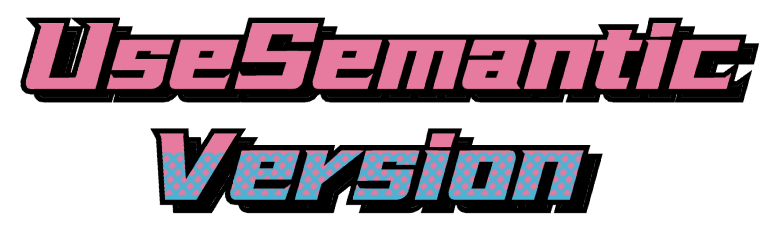

<p align="center">
  
</p>

<p align="center">
  <!-- npm version -->
  <a href="https://github.com/Lionad-Morotar/use-semantic-version"></a>
  <!-- ci status -->
  <a href="https://github.com/Lionad-Morotar/use-semantic-version/actions/workflows/ci-on-release.yml"></a>
  <!-- license -->
  <a href="https://github.com/Lionad-Morotar/use-semantic-version/blob/main/LICENSE"></a>
</p>

# use-semantic-version

a simple hook in Vue3 to manage semantic versioning

## Brief

```vue
import { useSemanticVersion } from 'use-semantic-version';

const { version, major, minor, patch, majoring, minoring, patching } = useSemanticVersion();

console.log('version:', version.value); // 0.0.1

patching();

console.log('version:', version.value); // 0.0.2
```

## License

MIT License

## Related

* [use-version](https://www.npmjs.com/package/@hmans/use-version)
